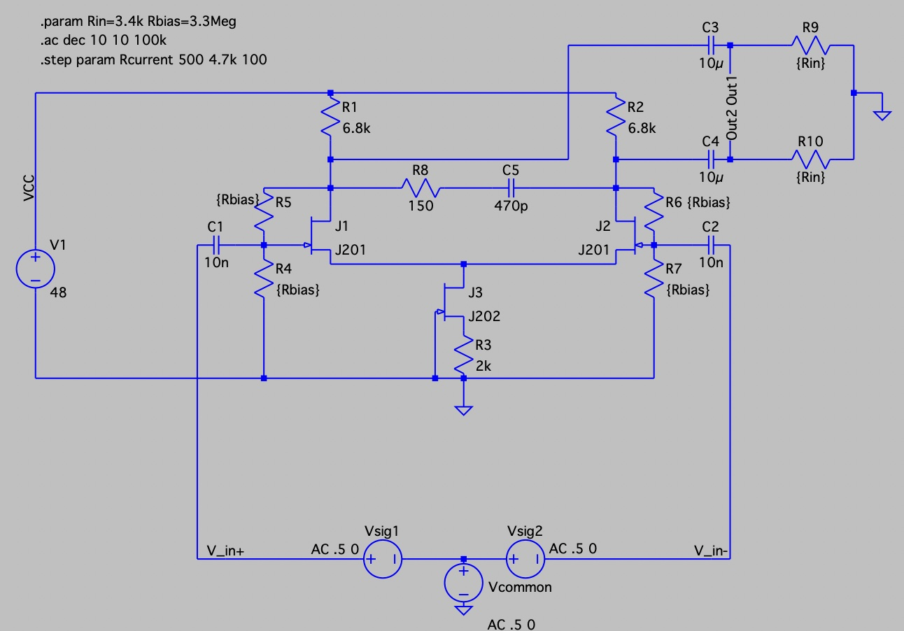
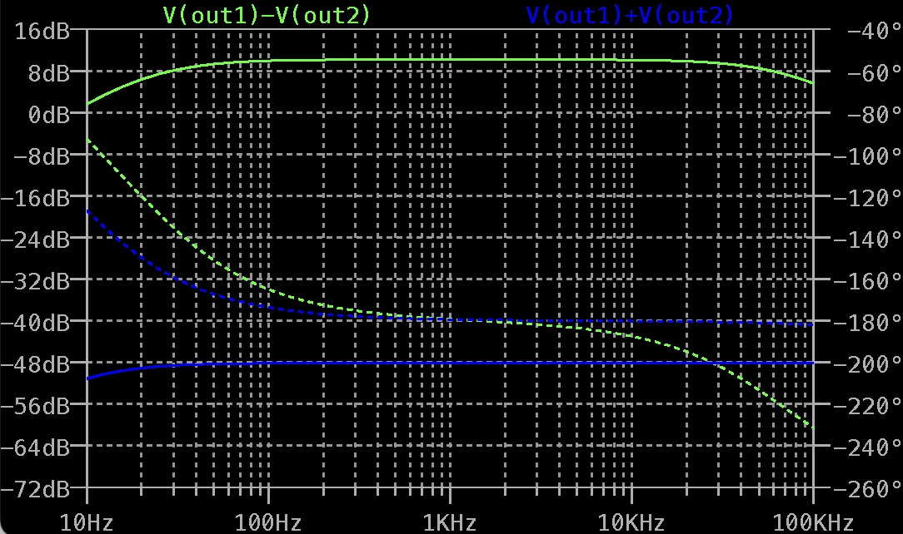
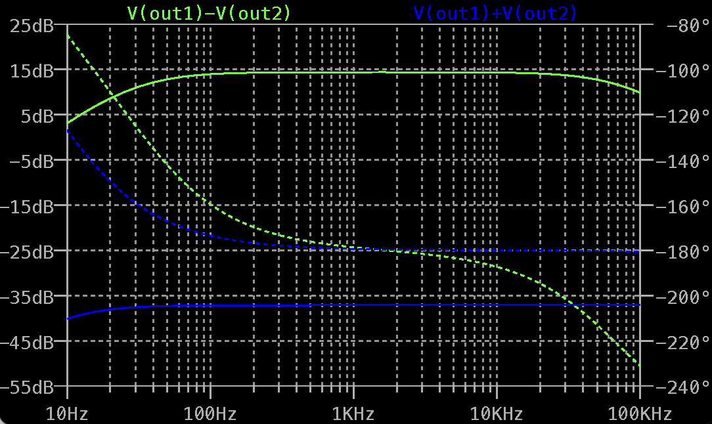
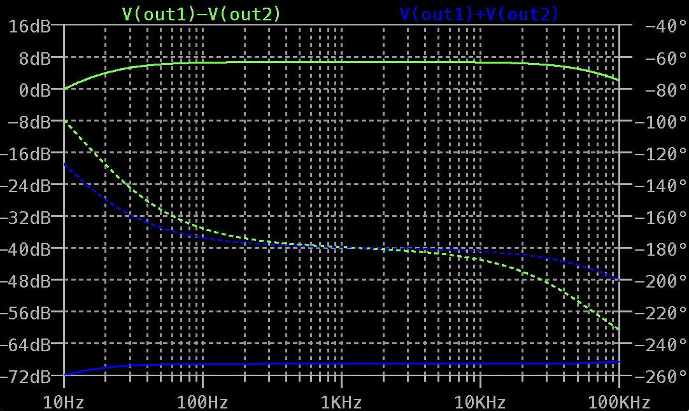
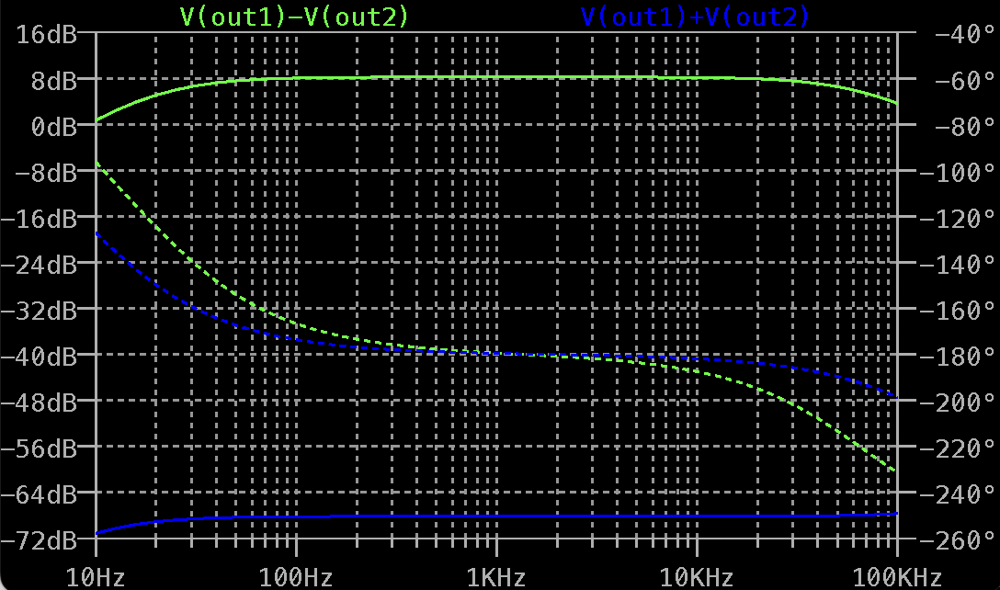
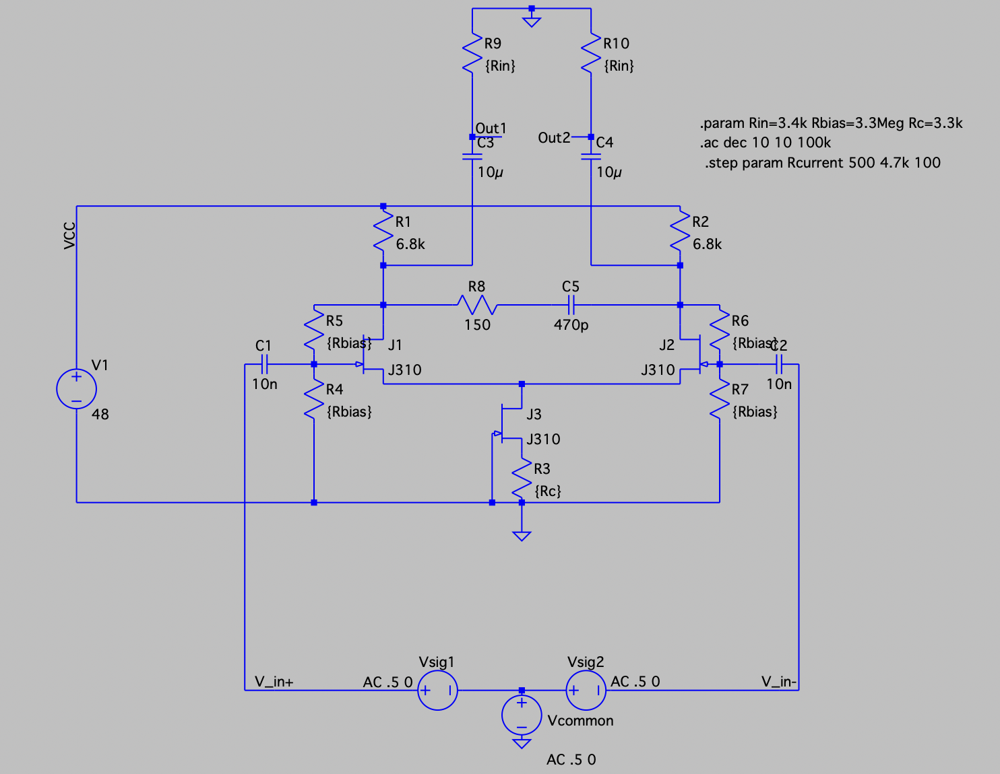
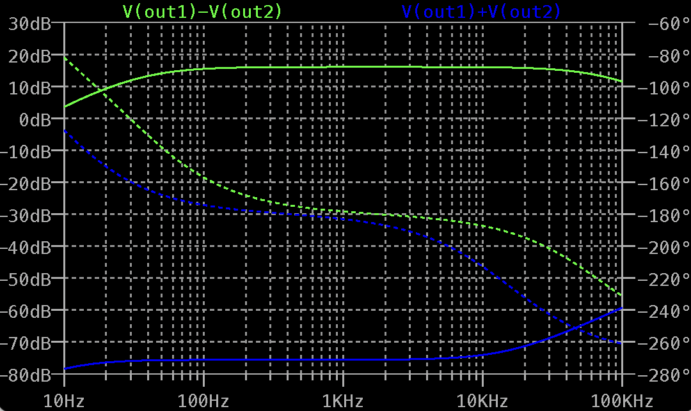
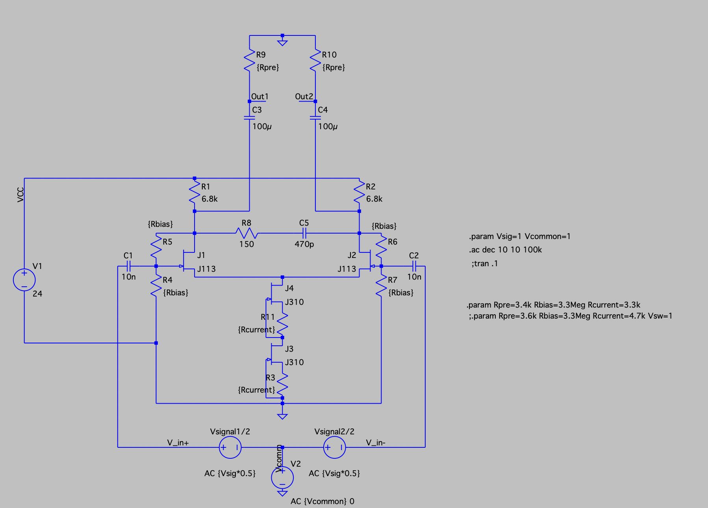
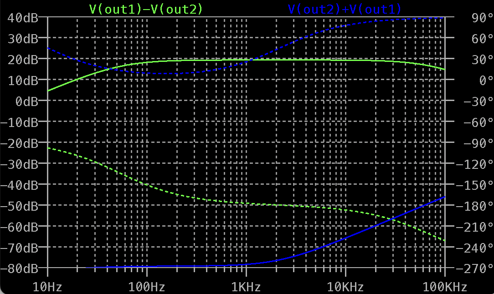

#Simulation
The simulations are done with similiar parameters, the approach is taken from [Sagittronics](https://sagittronics.wordpress.com/2019/07/04/simple-phantom-power-preamp-alex-rice-piezo-amplifier/), because the AC input impedance (R9, R10) behind the decoupling capacitors (C3, C4) plays a great role when comparing simulations to real measurements where the circuit is loaded. Interface AC Resistance is 2x 3.4k, amplifier input capacitors is set to 10n into 1.65Meg gate bias resistance, which calculate to 10Hz lower corner frequency, simulation shows about 20Hz. Upper corner is set by the zobel network, calculated at 2.3MHz but shows -3dB rolloff at 72KHz. I found these sufficient. Input AC voltage is set to  1Vpp, common mode to .5V.  Spice is showing relative values, 6dB amplitude gain 

LTspice was used for simulation, JFETs are chosen from the default library. Keep in mind that real JFETs can differ from these. 

##Low current design

The bias resistor R3 is a <i>tradeoff</i> between gain and common mode rejection (CMRR). If R3 is low, we can archive better gains because of higher current variation, but the CMRR is limited by the amplifier pair becoming unsymmetric due to clipping. Using higher R3 values is decreasing the gain, but archives better CMRR. It is possible to build energy saving, low gain preamps with high CMRR compliance. Replacing the J201 type J3 with a J202 and increasing the R3 value is a way to have moderate gain AND high CMRR. 

|Amplifier JFETs| Bias JFET| Bias resistor| Gain | CMRR |
|---|---|---|---|---|
|J201|J201|100R|9.4dB|49.2dB|
|J201|J202|100R|14dB|37.5dB|
|J201|J201|1k|5.4dB|70.2dB|
|J201|J202|1k|9.4dB|54.2dB|
|J201|J202|2k|<b>7.3dB</b>|<b>69.0dB</b>|

Using a J202 as current source in combination with J201 JFETs in the differential stage shows the gain best results when high CMRR is needed. This is the configuration I have chosen for the low-gain low current design.
###Preamp 2xJ201 + J201 , 100R Source Resistor

###Preamp 2xJ201 + J202 , 100R Source Resistor 

###Preamp 2xJ201 + J201 , 1k Source Resistor 

###Preamp 2xJ201 + J202 , 2k Source Resistor 

##High Current design with J113s 
By using J113 as JFETs for the differential amplifier in combination with a capable current source with a J310, good CMRR and higher gain can be archieved. 

The current source is limited in its voltage compensation, high R3 values decrease performance. 

<b>Workaround:</b> Doubling the current source in serial allows more voltage drop across the whole current source at good source resistor values and gives better gain due to a better placement of the amplifiers  operating point within phantom power range.
  
|Amplifier JFETs| Bias JFET| Bias resistor| Gain | CMRR|
|---|---|---|---|---|
|J113|J310|3.3k|<b>15dB</b>|<b>76dB</b>|
|J113|2x J310|3.3k per source|18.5dB|80dB|

###J113 Amplifier, single J310 Current Source

###J113 Amplifier, serial doubled J310 Current Source

The phase response looks somewhat weird, need to check that with a real circuit. 

For the final preamp design I have chosen the <b>first</b> design with a single J310 current source, because it meets the sweet spot between requirement and cost, matching amplifier AND current source JFETs would be necessary. 
0-Documentation