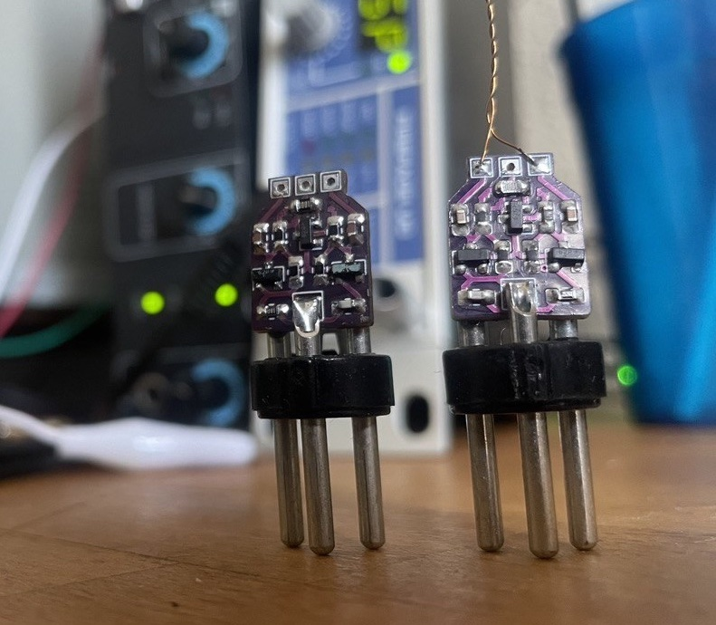
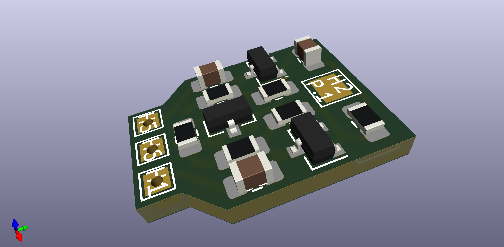
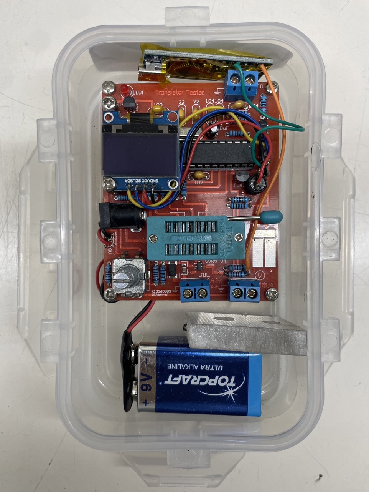
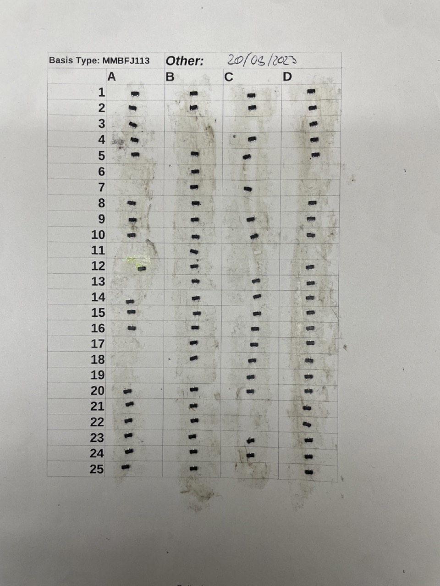
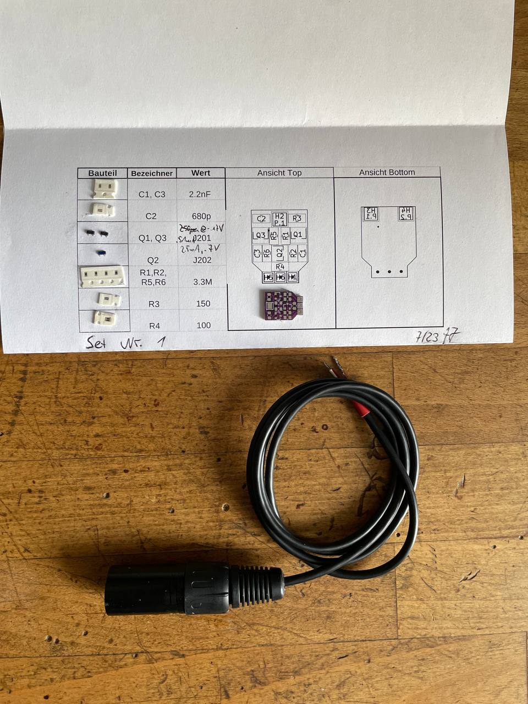
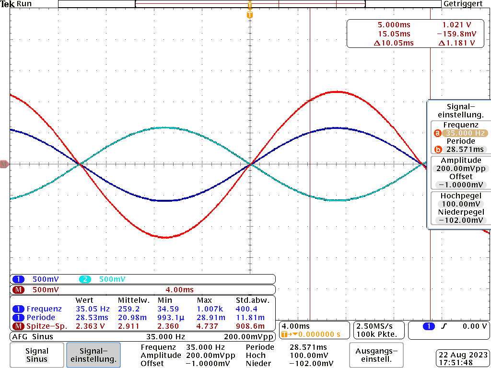
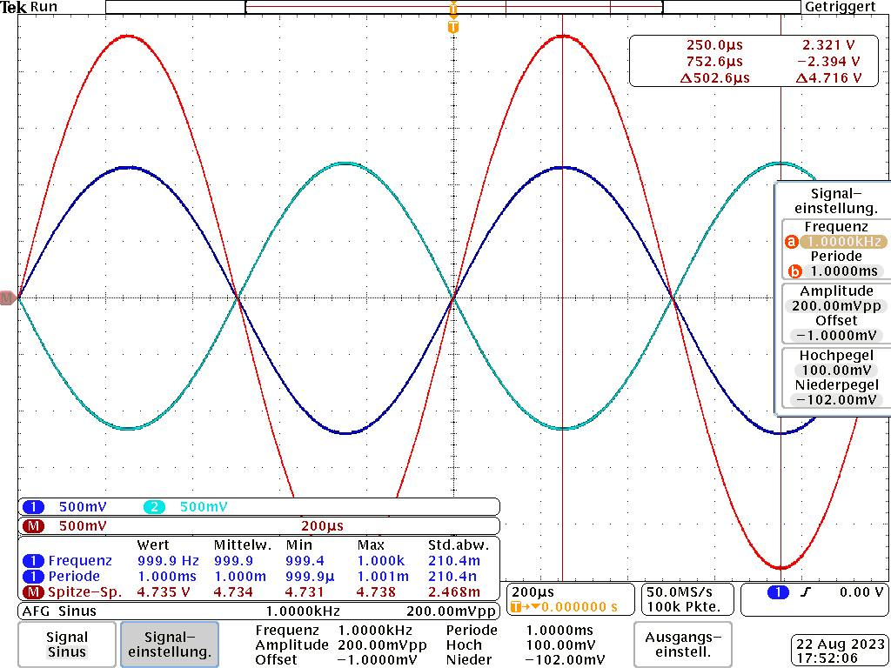
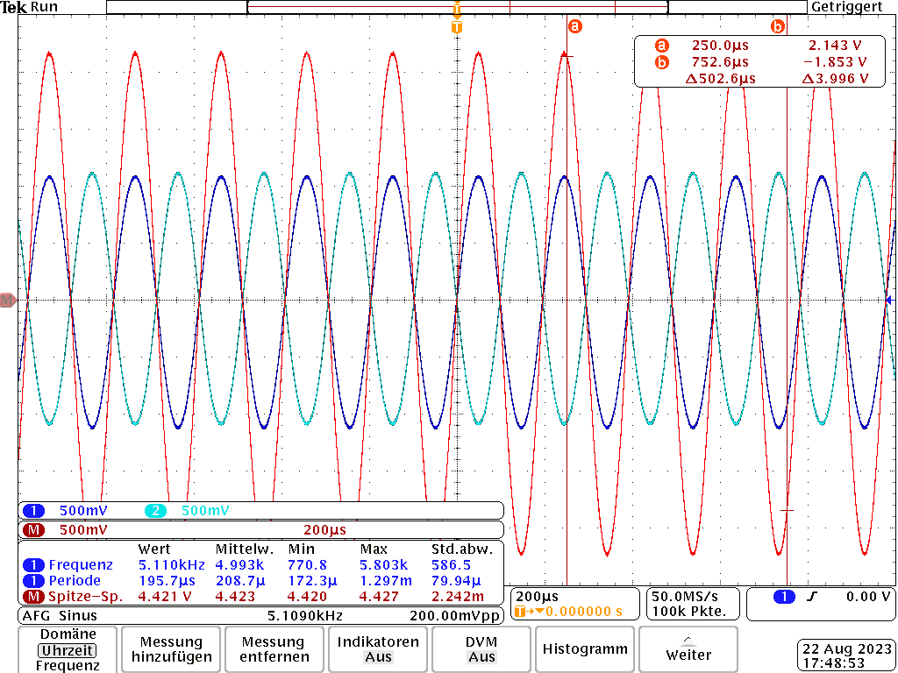
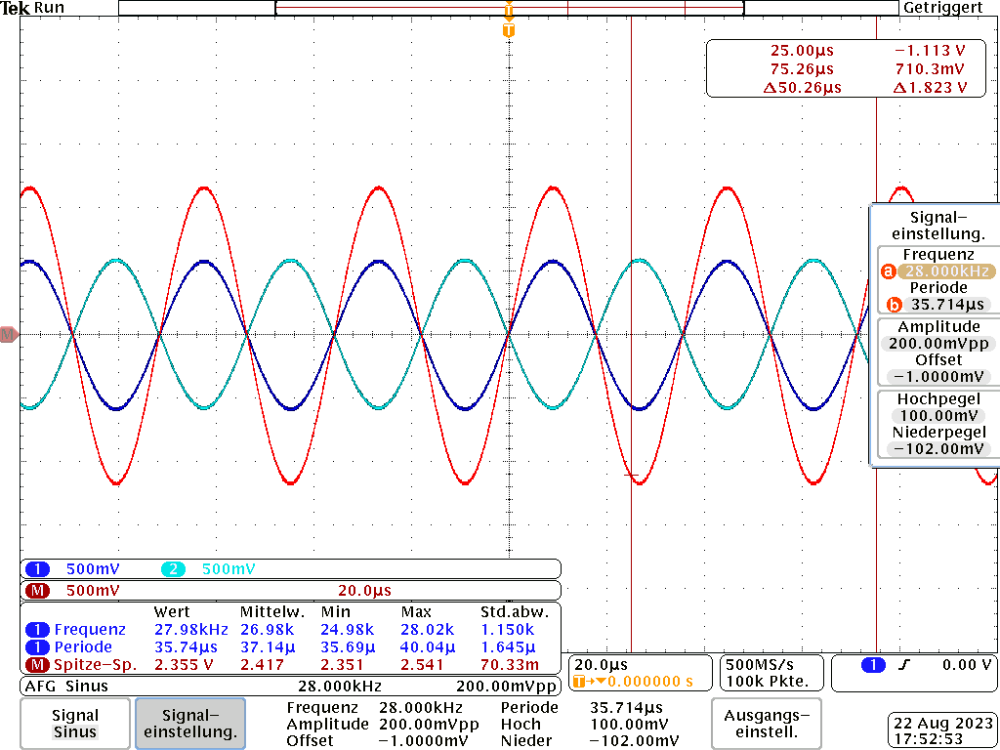
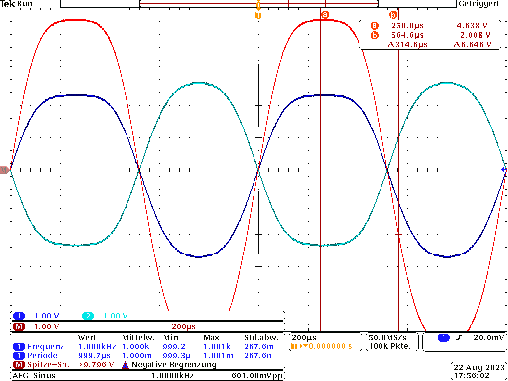

# RiceR - A rework of the Rice contact mic preamp 

This project is based on the initial work of Alexander Rice and its successors especially the design from [Zach Poff](https://www.zachpoff.com/resources/alex-rice-piezo-preamplifier/), which caught my interest as a PCB layout was provided. He also mentions Charles Staffeld from [Sagittronics](https://sagittronics.wordpress.com/2019/07/04/simple-phantom-power-preamp-alex-rice-piezo-amplifier/), who has done extensive simulation of the original circuit. This is of significant importance looking into the input impedances of your mixing or recording device (whatever your phantom source is) putting load on the AC (signal-) path. 
That explained a lot to me when I was exploring reasons for the low gain performance of my built copies of the Rice preamp (around 9dB was the most common case). 

The design itself is [KISS](https://en.wikipedia.org/wiki/KISS_principle), it is understood and the mentioned sources provie good desings, so why these effords? 

Because we <b>can</b> (make it always better).

## Thoughts 
The <b>J201</b>-based design is biased around <i>0.5mA</i> current, [Sagittronics](https://sagittronics.wordpress.com/2019/07/04/simple-phantom-power-preamp-alex-rice-piezo-amplifier/) uses <b>2N3819</b>s with <i>1mA</i> current source. Double current means 4 times  signal power with $`P=I^2*R`$. Can we do more?

### Input impedance and source current
We want 1.228$`V_{eff}`$ (+ 4dBu) at our recorder inputs for a starting point. The design overall is a symmetrical differential amplifier, so we split our amplitude to 1/2 excursion from 0 to the <i>+</i> and <i>-</i> signal input. We assume 2 times 3.6k AC load in parallel (e.G. for Zoom recorders, Sagittronics mentioned) and get roughly

$`I = 2 \cdot I_{signal} = 2 \cdot \frac{\frac{1.228 V }{2}}{3.6kOhm}`$. 

This calculates to 0.171mA per line and sums up to <b>0.341mA</b>. In case of having less than .5mA available, we can experience gain degradation due to current-limiting at the source. This is why the 2N3819 variant does <b>14dB</b> Voltage gain at low input impedances, compared to my <i>measured 9dB</i> for the J201 configuration, around 6dB more amplitude. 

You can choose recorders with High-Z at their inputs to compensate for that, but if you're in the fields for recording, you may find restrictions at having only your already chosen and beloved recording device. Mixers like Mackie's [VLZ04](https://mackie.com/img/file_resources/1604VLZ4_OM.pdf) has 2.5k at its microphone inputs, thus fulfilling input impedance with 10 times the 220Ohm Microphone impedance, but also a non High-Z load in the AC path. 

### Maximum Voltage excursion
If we have an recorder with High-Z input, we can calculate the maximum voltage change at the 6.8k resistors from inside your recording devices phantom power circuit. They are used as drain resistors here, so current change means changing voltage drop at the resistors, the AC part (our signal) is decoupled internally with capacitors. At 0.5mA, there are +/- 0.25mA per (differential) signal input, if we change input so that one line goes towards up until Phantom power (zero current over the injection resistor), the other one is pulled down towards ground, we got $`V_{eff}=3.4 V`$ (from 0.5mA * 6.8k) difference at maximum (we avoid thinking about clipping, and the JFETs nonlinear behavior at this operating point). The biasing network around the gates keeps the gate at half of the voltage drop over the current source and the amplifying JFET. Both gates are <i>floating</i> somewhere near the phantom voltage potential. 

Piezo discs as contact mics have pretty high output voltages, so we dont need as much as voltage amplification as possible, but a fair amount of output voltage swing is nice to have,(Zoom doesnt specify maximum input voltages for their [Handy Recorder](https://www.zoom-europe.com/de/handy-recorder) products , Mackie says +22dBu maximum at mic inputs for the VLZ04). We need a stronger current source to go beyond +0dB at the output. 

### JFET Types
I like the J201, but it has poor performance. Note that more recently produced J201s have less maximum saturation current in general. I tried to find some employable alternatives. 

Since JFETs have their gate implemented as reverse biased diode, the Gate of the used N-Channel J201 etc. is biased negatively as seen from source. in the worst case, the gate is tied to ground and the source just hanging at full phantom voltage. So we need to widthstand breakdown voltages $`V_{GSS}`$ as great as -48V negative voltages. This limits the set of useable JFET types somewhat, but we can minimize that a by subtracting the current source drop. 

<b>Transconductance:</b>
Small voltage changes will cause greater current changes at higher $`g_m=\frac{\Delta i_{out}}{\Delta u_{in}}`$. This results in higher voltage drop changes at the phantom power resistors. Higher $`g_m`$, more gain. 

<b>Saturation Current:</b> 
The saturation current $`I_{DS}`$ is important for the current source. You'll tie the gate to ground and put a source resistor into the current path. The JFET will limit the current if the drop voltage of the resistor exceeds the JFETs cutoff voltage.  Some J201s have so low saturation currents that even the source resistor can be dropped, so that gate and source are tied directly to ground and the JFET is running in $`I_{DSS}`$ mode at zero gate voltage. 

Saving a resistor is not our goal. External noise on both amplifier inputs is causing the current source to change its bias voltage to stabilize the current. If it is not able to do that, the amplified noise is not symmetric on both signal lines (one side may experience earlier amplitude clipping due to unsymmetric current delivery) and can't be cancelled out by the differential recorder input stage. Having a greater range of voltage swing at the current source will allow more common mode range. Higher voltage drop at the current source allows amplifier JFETs with less gate to source voltage specs.  

    
<b>Fun</b>
InterFet has a really interesting outline of their JFETs on their [website](https://www.interfet.com/jfet-master-table/), based on the geometry. 

| JFET Type    | $`V_{GSS}`$ min | $`I_{DSS}`$ (min)| $`g_m`$ Transconductance (min)|Noise|
|-----|-----|-----|-----|-----|
|[J201](https://www.mouser.de/datasheet/2/676/jfet_j201_j202_interfet-2887411.pdf)|-40V| 0.2mA|500µS|5nV / Hz |
|[J202](https://www.mouser.de/datasheet/2/676/jfet_j201_j202_interfet-2887411.pdf)|-40V| 0.9mA|1000µS|5nV / Hz |
|[J113](https://www.mouser.de/datasheet/2/676/jfet_j111_j112_j113a_interfet-2887724.pdf)|-40V|2mA|15000µS|1.2nV / Hz|
|[J301](https://www.mouser.de/datasheet/2/676/jfet_j308_j309_j310_interfet-2887299.pdf)|-25V|24mA|8000 µS|2nV / Hz| 
|[BF245C](https://www.nxp.com/docs/en/data-sheet/BF245A-B-C.pdf)|-30V|12mA|14000µS||
|[2N3819](https://www.interfet.com/jfet-datasheets/jfet-2n3819-interfet.pdf)|-25V|2.0mA|2000µS|7nV / Hz|

Four things can be optimized: 

- More gain from transconductance
- Higher amplitude at phantom resistors from higher current variation
- Higher common mode noise suppression by allowing the currrent source to vary more  
- Less noise  

### Phantom Power
[DIN EN 61938](https://schoeps.de/fileadmin/user_upload/user_upload/Downloads/Vortraege_Aufsaetze/Mikrofonaufsaetze/Mikrofonbuch_Kap13.pdf) defines a current of 10mA at 48V phantom voltage (phantom current at + and - signal path together).

This <b>doesn't</b> mean that <i>every</i> recording device has the capability of driving full 10mA but lets assume we have half of that available with semiprofessional equipment. 5mA current sourcing gives 2.5mA per branch in the amplifier, giving room for gain and output improvements.

## Circuit	
Please look after [Simulation](2 - Simulation/simulation.md) detailed circuits, simulations and results of the following approaches.  

### Approach 1: Current Source with more voltage excursion 
The J201 has a low cutoff voltage, so the voltage drop over the source resistor has is small (-0.3V min according to InterFET), asking for small resistor values to archieve this at operating point. Calculation gives 600Ohm, but in real life, I used smaller values around 100-150 Ohm to set the current output higher. This hinders the current source to lower output voltage if high common mode input puts both amplifying JFETs into conduction. 

Changing the current source J3 to a J202 JFET archives this, because it needs greater source resistor values to archieve the same current limit and allows for greater common mode input without clipping to ground.  
 

### Approach 2: J113 and J310 JFETs in Action
J113 and J310 have higher current specs. Especially the J310 in its function as current source is run far away from pinchoff Vg with higher source resistors. This enables the current source to float more up and down and allows more CMRR suppression down to -76dB while the amp itself provides <b>15dB</b> gain with <i>loaded</i> outputs. Plus less noise coming from the JFETS. 

### Approach 3: double current source 
A last experiment to get even more CMRR suppression requires more headroom at the current source. This is archieved to two current sources in serial configuration. Simulations show up additional -4dB CMRR, so its -80dB. Interestingly, the gain <i>rises</i> another 3.5dB too. Can't explain that at the moment. 

## PCB 
### THT vs. SMD

JFETs are still in use, but THT devices (with legs to be mounted through holes in your PCB) are kind of old-fashioned. Manufacturers know that and due to more smd-oriented PCB-Design nowadays, such components become more and more rare, thus difficult to get or <i>unreasonably</i> expensive. I didnt want to buy overpriced J201's from shady e**y stores or hipster-wallet oriented offers, and so I went on with the [SMD MMBFJ201](https://www.reichelt.de/n-kanal-jfet-40v-0-2-1ma-0-35w-sot-23-mmbfj201-p360202.html?&trstct=pos_0&nbc=1) of the J201, which costs less (0.30€)  of what a is asked for [THT J201](https://www.mouser.de/ProductDetail/InterFET/J201?qs=OxRSArmBDfyvD8SbvWteMw%3D%3D).

### Making Things smaller
My goal was to fit the whole preamp into an XLR plug. The metal housing is well grounded by the recorder and acts as shield for the amplifier. 

There are two <b>caveats</b>: capacitance/charge changes in the cable between preamp and piezo and also microphonic events like tapping the connectors housing can be heard. First is caused by the cable itself acting as a microphonic capacitor between ground and signal lines and second effect comes from the piezoelectricity of the ceramic SMD capacitors. SMD PP or PE caps in 0402 size were not available (if any ever?) so thats a tradeoff.

 
## Mass FET Matching
The amp is a differential (thus symmetric) design. To get good performance, matched components are needed, especially the JFETs whose can deviate from the specified mean value, even if they came from the same production run. Resistors and capacitors are easier to match, you can just buy them with good specs (1% SMD resistors are not as expensive as similiar THT maybe 20 years ago)

Not perfect, but good enough: 

 * Buy some run-of-the mill china copy of a [component tester](https://www.ebay.de/itm/265065551933?hash=item3db723583d:g:t-kAAOSwvWNgNhKa&amdata=enc%3AAQAIAAAA4MVZA11pXEi%2BY8FpUKZ%2Ba6fGrj%2Bg92W5g%2BvEFuaV7X8trvuxUWNuu%2BiUo3P4QnSn8eicAGEaVRB%2BaX3sno8Zs7n9p32MTcgCp%2FKcCjfit%2Bm41IrsrzKEI65ftT0AGj6qV5wsm%2BSe9ota6LyMAYbrZ3AixUm3jQbcnIuPTjFkVYe%2Big%2BgnT9Nog9wD%2F92axCRTxBFWWMISdoD28%2FKe9K8RMAzgf7rEN7JKfyHri0wTwoJ5zPvL857RYVo45sQIgmp1lrfoy2E4d%2F9Fjsllpe8T1pWKjBM68IU9CnFLe9h732N%7Ctkp%3ABk9SR4qI0vqmYw) based on the work of [Markus Frejek and Karl-Heinz Kübbeler](https://www.mikrocontroller.net/articles/AVR_Transistortester#Hint_to_Cloners_and_Sellers_中文). The versions with the 3 SMD pads next to the test socket are good for putting JFETS with SOT-3 housing on.
 * Get [firmware souce](https://github.com/Mikrocontroller-net/transistortester/tree/master) and compile it with UART support. (I had to replace my SPI display with an I2C oled one to free pins for UART, you can also remove the display)
 * Test components: put some on, press the button verify the measurement is done 
 * Label the components! My favorite is a [glued sheet](0 - Documentation/JFET_Matching.jpeg) with a table with numbers, where I put freshly tested components on. 
 * Record the UART output into a file e.g. with [putty](https://putty.org) 
 * CSV import: Use MS Excel or Libreoffice Calc to get the test parameters from the uart record text file into a spreadsheet, convert it into a table that parameters from the same component stick together
 * sort for <b>IDss</b>, <b>ID0</b> and <b>V_g at pinchoff</b> and use the most similiar parts together (same readings)

|Transistor tester lunchbox|JFETs on labeled glue sheet|
|---|---|
|||

## Finished Preamp
### Building kit 
Finished preamp housed in XLR plug, above is a prepared building kit, including matched parts and PCB. 

### Measurements with real built High-Gain preamp
These measurements were done at 
 * 48V phantom power, 6.76k resistors 
 * -11.77 dbU (200mV to 0.775V)  amplitude of the input sine  
 * 10k load resistance, roughly 5 times greater than in simulations not good in terms of comparability

|Freq.| 35Hz| 1kHz |5KhZ | 28KHz |
|---|---|---|---|---|
||  | |||
|abs. Output|  9.68dBU, HP rolloff  | 15.72dBU  | 15.12dbU  | 9.65dBU LP rolloff| 
|relative to 0.2V | 21.44dB | 27.49dB | 26.89dB | 21.42dB |

These values are nearly double the simulated gain, which could be explained with the ecxeptional high load resistance (20k in parallel). Simulating the J113/J310 circuit again results in 26dB relative gain, not that far off.  

### Clipping 
JFETs do clip soft. I am running them at 2.21dbU at the input, getting >+22dbU of output voltage swing here. Thats a LOT, ensure your recording/mixing hardware can handle such voltages, or your input protection will kick in and may get damaged (remembering those A&H DJ mixers killing Zoom recorders...?). It shall just show that the High-Gain amplifier with J113/J310 JFETs is capable of some serious voltage swing.

 
## Epilog
I made these kits for a workshop with non-experienced solder. If you like to build one for yourself, feel free, to use [schematic and pcb files](1 - Hardware/PCB) to do your own. I still have some PCB+Parts kits (without XLR-Plug) sitting around and will sell them to you in the mentioned onepage-kit form if you contact me.  
